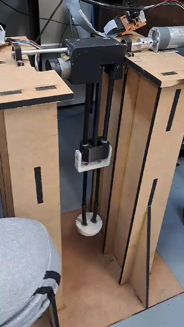
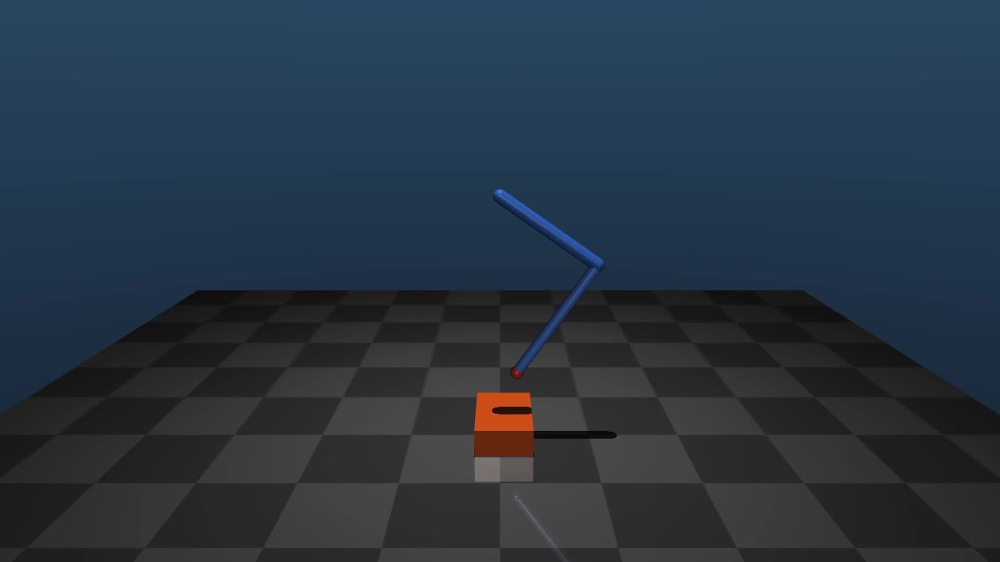

# PI-7 — Robotic Leg / Lower-Limb Prosthesis

Project for the **Projeto Integrado — 7th Semester (PI-7)** course at the
University of São Paulo's Polytechnic School (PMR3403 - Actuators and
Drives / PMR3405 - Mechanisms for Automation), supported by PMR3404
(control systems) and the PMR3409 Digital Control course. The course has
had 10 prior editions (2010-2019); this edition (2024) proposed a
**lower-limb prosthesis mockup for motor rehabilitation**, capable of
reproducing hip and knee flexion/extension movements while stepping over
an obstacle during gait.

Base firmware authorship: Jun Okamoto Jr., built on an original template
by Prof. Marcos Barretto. PI-7 2024 development: Victor Nascimento
Pereira, Danilo Dacca, Vitor Viana and Eduardo Araujo.

---

## Videos

| Real prototype | MuJoCo simulation |
| --- | --- |
| [](docs/midia/leg_demo.mp4) | [](docs/midia/mujoco_sim.mp4) |
| [`leg_demo.mp4`](docs/midia/leg_demo.mp4) — MDF "inverted T" base, motor+gearbox at the hip, thigh/shin linkage and a 3D-printed foot performing the real movement. | [`mujoco_sim.mp4`](docs/midia/mujoco_sim.mp4) — C + MuJoCo reconstruction (see [`sim/`](sim/README.md)) of the same trajectory, inverse kinematics and PID controller, running on a simulated physical model. |

*GitHub doesn't play embedded `.mp4` video in the README — click the
thumbnail to open the file. More photos/videos of the real prototype will
be added here soon.*

---

## Project requirements

- **Objective**: design and build an actuated, controlled mechanism that
  demonstrates the potential to replace the human lower limb in thigh and
  knee flexion/extension movements during walking, with a specific focus
  on stepping over an obstacle.
- **Scale**: approximately 1:2.5 of a human leg (final links: thigh/L1 =
  210mm, shin/L2 = 247mm — roughly 1:2.1 given the reference human length
  of 954mm for a 1.80m-tall person).
- **Mechanism**: 2 degrees of freedom (hip + knee), mounted on a fixed
  "inverted T" base (the hip doesn't translate — only the thigh and shin
  move, as in a bench-top rig).
- **Reference obstacle**: 260mm tall, 60mm wide (at human scale, per the
  course assignment).
- See [`docs/Tema_PI7_2024_v2.pdf`](docs/Tema_PI7_2024_v2.pdf),
  [`docs/Apresentação do PI7.pdf`](docs/Apresentação%20do%20PI7.pdf) and
  [`docs/Conexoes PI-7 2024.pdf`](docs/Conexoes%20PI-7%202024.pdf) (not
  version-controlled in this git repo, but present in the project
  directory) for the full assignment, biomechanical requirements and the
  module connection diagram.

---

## Hardware

Control architecture distributed across 3 levels, per
[`docs/Conexoes PI-7 2024.pdf`](docs/Conexoes%20PI-7%202024.pdf):

```
PC  <--USB/Modbus-ASCII-->  Raspberry Pi Pico W  <--UART/custom protocol-->  PIC16F886 (hip)
                                                  <--UART/custom protocol-->  PIC16F886 (knee)
```

- **Raspberry Pi Pico W**: receives the trajectory and PID gains from the
  PC over simplified Modbus-ASCII (USB), computes the 2-link inverse
  kinematics (thigh+shin) and forwards the angular setpoints and gains to
  both PICs.
- **2× PIC16F886**: one per joint (hip = address `'a'`, knee = address
  `'b'`), each running its own local PID control loop and reading its own
  encoder — see the Control section.
- **2× L298 H-bridge** (one per motor) + a **7805** regulator (steps the
  12V supply down to 5V) to drive the DC motors.
- **+12V @ 10A switching power supply** feeding the H-bridges.
- **Encoders** (1852 pulses per output-shaft rotation of the gearbox),
  read via Interrupt-on-Change on Port B of each PIC.
- 26-wire flat cable connector between each PIC and its H-bridge, carrying
  PWM1/PWM2/DIR1 signals, encoder (ENC_A/ENC_B), power, and ICSP
  programming.
- Serial↔USB adapters used for testing/bypass (driving the PICs directly
  from a PC, replacing the Pico W, when needed).

*(photos of the real electronic/mechanical assembly will be added here soon)*

---

## Software

The project has three software "layers", each in its own
directory/project:

### 1. Raspberry Pi Pico W firmware (`src/`)

FreeRTOS running on the RP2040 (built via `CMakeLists.txt` + the Pico SDK,
see `pico_sdk_import.cmake`). Main modules (`src/pi7/`):

- `comm_pc/modbus.c` — simplified Modbus-ASCII protocol with the PC
  (function 0x03 read register, 0x06 write register, 0x15 trajectory
  upload, 0x08 PID gain upload).
- `command_interpreter/` — register map (start/pause/resume/stop, current
  position, current program line).
- `trj_program/` — stores the trajectory program (up to 28 foot (x,y)
  points) — see the Trajectory section.
- `trj_control/` — 2-link inverse kinematics that converts each (x,y)
  trajectory point into hip and knee angles — see the Trajectory section.
- `trj_state/` — current state (program line, X/Y).
- `comm_pic/` — low-level protocol with the PICs
  (`:<address><command><value>;`, commands `p`=position, `g`/`i`/`d`=P/I/D
  gains, `h`=home) over UART0 (hip) and UART1 (knee).

### 2. PIC firmware (`pidx.X/pidx.X/`)

MPLAB X/XC8 project for the **PIC16F886**, one per joint — this is the
controller that actually closes the position loop, reading its own
encoder and driving the motor via PWM (details in the Control section).
**Not version-controlled in this git repository** (it only exists on
local disk), but it's a central piece of the project. See
`pidx.X/pidx.X/README.md` for the full implementation explanation.

### 3. PC software (`ANTLR+MODBUS/`)

- `serial_communication.py` — parses the trajectory G-code (via the
  ANTLR-generated parser), builds the Modbus-ASCII messages (PID gains,
  trajectory upload, start/pause/continue/stop commands) and sends them
  to the Pico W over serial USB.
- Final PID gains used: hip Kp=25 Ki=3 Kd=0, knee Kp=5 Ki=1 Kd=0
  (`set_ganho()`).

---

## Control

Two-level control loop, running at different rates:

- **Pico W (200ms)**: `taskNCProcessing` generates a new angular setpoint
  every 200ms from the next (x,y) trajectory point, via inverse
  kinematics (`tcl_generateSetpoint`), and sends it to the PICs.
- **PIC16F886, one per joint (100ms)**: `pid.c` closes the local loop,
  reading its own encoder and recomputing the PID every 100ms
  (`PID_INTERVAL`) — between ticks, the received setpoint is held
  (sample-and-hold).

Despite the name, the controller **only applies the proportional term**:
`activation = kp * error`. Setters for Ki/Kd exist and receive values
over the serial protocol, but they're never added in `pid_pid()`. Two
quirks of the real firmware:

- **"Initial kick"** of ±150 (out of a ±1000 saturation range) applied to
  any nonzero error before saturating — needed because the motor used
  only turned above ~15% duty cycle (a mechanical dead zone in the
  motor+gearbox).
- **Encoder scaling**: pulses converted to degrees by dividing by 5 (an
  integer approximation of 1852 pulses/rotation ÷ 360 ≈ 5.14, truncated),
  producing a small steady-state error (~2.9%) on the real hardware.

Gains used (`ANTLR+MODBUS/serial_communication.py`, `set_ganho()`): hip
Kp=25 Ki=3 Kd=0, knee Kp=5 Ki=1 Kd=0 — though since only the P term is
applied, only Kp actually matters.

---

## Trajectory

The foot trajectory is described in a simple G-code dialect, in
`ANTLR+MODBUS/GCode-example`:

```
N001 G01 X000 Y420
N002 G01 X006 Y398
...
N027 G01 X314 Y408
N028 M30
```

Each line is a foot trajectory point (x,y) in mm during the swing phase
over the obstacle. The points were drawn/adjusted by hand, iteratively
(there's no algorithmic gait generation in the repository): it started as
a 2-point test, went through a 50-point version, and was finally trimmed
down to the **current 27 points** (removing intermediate ones while
preserving the curve's shape).

Processing pipeline:

1. `ANTLR+MODBUS/GCode.g4` — ANTLR4 grammar for the G-code dialect,
   compiled into a Python lexer/parser/listener (`GCodeLexer.py`,
   `GCodeParser.py`, `GCodeListener.py`).
2. `serial_communication.py` — uses the generated parser to extract the
   (x,y) points and sends them as a trajectory upload (Modbus-ASCII) to
   the Pico W.
3. `trj_control.c` (`tcl_generateSetpoint`, on the Pico W) — converts
   each (x,y) point into hip/knee angles via 2-link inverse kinematics
   (law of cosines), producing a new setpoint every 200ms.

The program is a single step over the obstacle (not a full gait cycle):
it ends in the air, near the last point, without automatically returning
to the ground.

---

## Simulation

Since the physical leg and hardware are no longer available, the
[`sim/`](sim/README.md) directory contains a **C + MuJoCo simulation**
that reconstructs the full system's behavior — inverse kinematics, the
real trajectory, and the real PID controller (ported from the PIC
firmware) — running on a simulated physical model of the leg (fixed hip,
thigh and shin, obstacle on the ground). Video in [Videos](#videos)
above.

Key points (full details in [`sim/README.md`](sim/README.md)):

- Inverse kinematics ported literally from `trj_control.c`.
- PID controller ported literally from `pidx.X/pidx.X/pid.c` (including
  the ±150 "kick" and the fact that it's purely proportional), with a few
  extra adjustments (error dead zone, joint damping) to compensate for
  the real motor's static friction, which MuJoCo doesn't model.
- The real 27-point trajectory embedded.
- Two binaries: `leg_view` (interactive viewer) and `leg_record` (records
  an `.mp4` video).

```bash
cd sim
./build/leg_view          # interactive viewer (once built, see sim/README.md)
./build/leg_record out.mp4
```

---

## License

MIT — see [`LICENSE`](LICENSE). Original FreeRTOS/Pico W base by Jun
Okamoto Jr.
